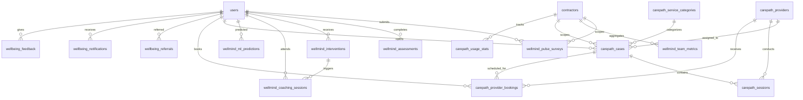

# Wellbeing Module Database Schema

## Overview

17 tables across 3 modules supporting employee wellbeing tracking, CarePath services, and cross-module integration.

| Module | Tables | Purpose |
|--------|--------|---------|
| WellMind | 7 | Preventive wellbeing: pulse surveys, assessments, interventions, coaching, ML predictions |
| CarePath | 6 | Employee support: cases, sessions, providers, bookings |
| Integration | 4 | Cross-module: referrals, notifications, audit log, feedback |

**Totals:** 38 RLS policies, 89+ indexes, 8 helper functions, 3 views, 1 materialized view.

## ER Diagram



## Tables

### WellMind Module (Migration 058, renamed in 062)

#### wellmind_questions
Question bank for pulse surveys and quarterly assessments. Global (not contractor-scoped).

| Column | Type | Notes |
|--------|------|-------|
| id | UUID PK | |
| question_type | VARCHAR(50) | 'pulse' or 'assessment' |
| question_text | TEXT | Hungarian |
| question_text_en | TEXT | English translation |
| response_type | VARCHAR(50) | 'scale_1_10', 'emoji_5', 'yes_no', 'text' |
| category | VARCHAR(100) | mood, stress, sleep, workload, engagement, burnout sub-dimensions |
| is_active | BOOLEAN | Soft delete |
| display_order | INTEGER | UI ordering |

#### wellmind_pulse_surveys
Daily mood check-ins. One per user per day (UNIQUE constraint).

| Column | Type | Notes |
|--------|------|-------|
| id | UUID PK | |
| user_id | UUID FK→users | |
| contractor_id | UUID FK→contractors | Tenant isolation |
| survey_date | DATE | Default CURRENT_DATE |
| mood_score | INTEGER 1-5 | Emoji: 😞😐🙂😊😁 |
| stress_level | INTEGER 1-10 | |
| sleep_quality | INTEGER 1-10 | |
| workload_level | INTEGER 1-10 | |
| notes | TEXT | Optional comment |

**Indexes:** user+date (trend queries), contractor+date (aggregation)

#### wellmind_assessments
Quarterly burnout/engagement evaluations with MBI + UWES scoring.

| Column | Type | Notes |
|--------|------|-------|
| id | UUID PK | |
| user_id | UUID FK→users | |
| quarter | VARCHAR(10) | '2026-Q1' format, UNIQUE with user_id |
| responses | JSONB | Raw answers |
| burnout_score | DECIMAL(5,2) | 0-100 composite |
| engagement_score | DECIMAL(5,2) | 0-100 composite |
| emotional_exhaustion_score | DECIMAL(5,2) | MBI sub-dimension |
| depersonalization_score | DECIMAL(5,2) | MBI sub-dimension |
| personal_accomplishment_score | DECIMAL(5,2) | MBI sub-dimension |
| vigor_score | DECIMAL(5,2) | UWES sub-dimension |
| dedication_score | DECIMAL(5,2) | UWES sub-dimension |
| absorption_score | DECIMAL(5,2) | UWES sub-dimension |
| risk_level | VARCHAR(20) | green / yellow / red |
| risk_factors | JSONB | Identified risk drivers |

**Risk thresholds:** green (burnout<40 AND engagement>60), yellow (burnout 40-70 OR engagement 40-60), red (burnout>70 OR engagement<40)

#### wellmind_interventions
Recommended actions. Full lifecycle: recommended → accepted/declined → in_progress → completed/expired.

#### wellmind_coaching_sessions
1-on-1 coaching between employee and coach/HR. Coach notes restricted by RLS.

#### wellmind_team_metrics
Aggregated team wellbeing. **Privacy: CHECK(employee_count >= 5)** prevents individual identification.

#### wellmind_ml_predictions
ML turnover risk predictions. Admin-only access. Includes outcome tracking for model validation.

### CarePath Module (Migration 059, renamed in 062)

#### carepath_service_categories
6 service types: Counseling, Legal, Financial, Family, Crisis, Work-Life Balance.

#### carepath_providers
External professional directory. 20 providers seeded. Supports geo-proximity search via lat/lng. GIN indexes on specialties and languages arrays.

#### carepath_cases
Employee cases. `issue_description` and `resolution_notes` encrypted via application-layer AES-256-CBC. Admin can see metadata but NOT case content. Supports anonymous mode. Case numbers: `CP-YYYYMMDD-XXXX`.

#### carepath_sessions
Session notes encrypted via pgcrypto (`pgp_sym_encrypt`). Only provider + case owner can access.

#### carepath_provider_bookings
Appointment scheduling. Double-booking prevented by `UNIQUE(provider_id, appointment_datetime)`.

#### carepath_usage_stats
Monthly aggregated statistics. No PII — only counts and averages. One row per contractor per month.

### Integration Module (Migration 060)

#### wellbeing_referrals
Cross-module referrals (WellMind ↔ CarePath ↔ Chatbot). Auto-expires after 30 days via trigger.

#### wellbeing_notifications
Multi-channel notification queue (push, email, SMS, in-app). Supports scheduled delivery and retry.

#### wellbeing_audit_log
**Immutable** GDPR-compliant access log. UPDATE and DELETE blocked by RLS `USING(false)` policies.

#### wellbeing_feedback
User satisfaction tracking. Supports anonymous mode.

## RLS Policies Summary

| Table | Policies | Access Model |
|-------|----------|-------------|
| wm_questions | 2 | All read, admin write |
| wm_pulse_surveys | 2 | Own data + admin read |
| wm_assessments | 2 | Own data + admin read |
| wm_interventions | 2 | Own data + admin full |
| wm_coaching_sessions | 2 | Own + coach + admin |
| wm_team_metrics | 2 | Manager/admin only |
| wm_ml_predictions | 1 | Admin only |
| cp_categories | 2 | All read, admin write |
| cp_providers | 2 | Active read, admin full |
| cp_cases | 2 | Own + admin metadata |
| cp_sessions | 3 | Own + provider + admin |
| cp_bookings | 3 | Own + provider + admin |
| cp_usage_stats | 2 | Admin only |
| wb_referrals | 2 | Own + admin/manager |
| wb_notifications | 3 | Own read + own update + admin |
| wb_audit_log | 4 | Admin read, system insert, no update, no delete |
| wb_feedback | 2 | Own + admin read |

## Helper Functions

| Function | Purpose |
|----------|---------|
| `calculate_burnout_composite(ee, dp, pa)` | Weighted burnout: EE×0.45 + DP×0.25 + (100-PA)×0.30 |
| `calculate_engagement_composite(v, d, a)` | Weighted engagement: Vigor×0.35 + Dedication×0.40 + Absorption×0.25 |
| `determine_risk_level(burnout, engagement)` | Returns green/yellow/red based on thresholds |
| `refresh_wellbeing_summary()` | Refreshes mv_user_wellbeing_summary materialized view |

## Sample Queries

```sql
-- User's pulse trend (last 30 days)
SELECT survey_date, mood_score, stress_level
FROM wellmind_pulse_surveys
WHERE user_id = $1 AND survey_date >= CURRENT_DATE - 30
ORDER BY survey_date;

-- High-risk employees (admin)
SELECT user_id, turnover_risk_score, risk_level, top_risk_factors
FROM wellmind_ml_predictions
WHERE contractor_id = $1 AND risk_level = 'red'
ORDER BY turnover_risk_score DESC;

-- Provider search with geo-proximity (Haversine)
SELECT *, (6371 * acos(
  cos(radians($1)) * cos(radians(geo_lat)) *
  cos(radians(geo_lng) - radians($2)) +
  sin(radians($1)) * sin(radians(geo_lat))
)) AS distance_km
FROM carepath_providers
WHERE is_active = true AND geo_lat IS NOT NULL
ORDER BY distance_km LIMIT 10;

-- Pending notifications for delivery
SELECT * FROM v_pending_notifications;

-- User wellbeing summary (materialized)
SELECT * FROM mv_user_wellbeing_summary WHERE user_id = $1;
```

## Migrations

| ID | Name | Description |
|----|------|-------------|
| 058 | blue_colibri_schema | 7 WellMind tables + RLS + seed questions |
| 059 | eap_schema | 6 CarePath tables + pgcrypto + RLS + seed providers |
| 060 | wellbeing_integration | 4 integration tables + views + triggers |
| 061 | comprehensive_seed_data | Test data + functions + materialized view |
| 062 | rename_wellmind_carepath | Rename Blue Colibri → WellMind, EAP → CarePath |
